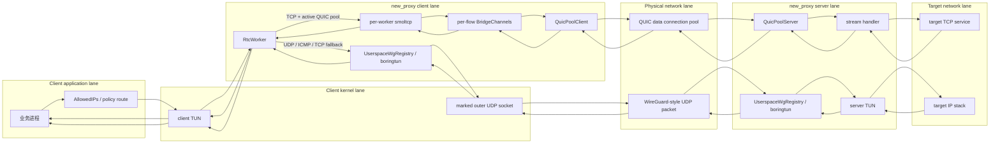

# new_proxy 当前架构说明

本文档描述当前代码实现，不描述规划能力。若架构设计发生变化，先更新本文档，再补对应测试。

## 1. 总体模型

`new_proxy` 是一个混合 L3/L4 网关：

- **L3 数据面**：
  - **服务端**：打开 TUN 设备并通过内建 `boringtun` 处理 WireGuard 风格 L3 加解密；配置 `Table = auto` 时会为 peer AllowedIPs 下发指向 TUN 的路由。
  - **客户端**：采用用户态协议栈。启动时如果已有 proxy peer 成功建立 QUIC pool，或控制面已返回 data port 数但 QUIC data 连接暂时失败，TUN 队列数按该 data port 数创建；如果启动时没有任何已知 QUIC data port 数，则先创建 1 个 TUN 队列作为最小可用数据面。随后程序配置该 TUN 的地址和 AllowedIPs 路由；在进程内通过 `boringtun`（用户态 WireGuard 协议库）对 UDP/ICMP 报文和 TCP fallback 报文进行加密封装，并发送至宿主机物理网卡。客户端不再同步 peer 到内核 WireGuard 设备，但创建 TUN 和配置路由仍需要相应系统权限（通常是 `CAP_NET_ADMIN` 或 root）。
- **L4 TCP 路径**：
  - **服务端**：通过物理 QUIC 连接池接收并解密来自客户端的透明流。
  - **客户端**：通过 TUN 拦截 TCP 流量，由各 TUN 队列对应的 `RtcWorker` 内部 `smoltcp` 用户态协议栈接管。建立连接后，通过在进程内桥接 `smoltcp` 套接字与对应的 QUIC 复用连接流（Quinn）进行转发，从而完全免除了内核 iptables 和 TPROXY 的防火墙规则依赖。同一 TCP flow 的状态保存在接收该 flow 的 worker 中，当前实现依赖 Linux TUN multiqueue 的 flow queue affinity。
- **控制面**：独立的 UDP 报文协议，使用 WireGuard 密钥材料派生 X25519 shared secret，并用 HMAC-SHA256 认证 JSON 请求/响应。
- **QUIC 数据面**：使用服务端自签证书，服务端在已认证控制面响应中下发证书 SHA-256 指纹，客户端只接受该指纹对应证书。
- **运行期 API**：通过 Unix Domain Socket 提供 `Stats`、`Dump`、`AddPeer`、`RemovePeer` API。

## 2. 运行模式

启动模式由配置决定：

- Server mode：`ListenControlPort` 存在，或 `[QUICPool].ListenPorts` 非空。
- Client mode：非 server mode，且至少有一个 `[Peer]`。

Server mode 要求：

- `ListenControlPort` 必须存在。
- `[QUICPool].ListenPorts` 至少一个端口。
- peer 可以只配置 `PublicKey` 和 `AllowedIPs`，用于接受控制面协商与 L3 遥测展示。

Client mode 支持：

- **用户态混合代理**：TCP 流量匹配 proxy peer 的 `AllowedIPs` 最长前缀后卸载到用户态 QUIC 连接池中；UDP/ICMP 以及 QUIC 不可用时的 TCP fallback 通过 `boringtun` 在用户态进行 WireGuard 加密封装。
- proxy peer 需要同时配置 `Endpoint` 和 `ProxyPort`。`ProxyPort` 是控制面 UDP 端口；`Endpoint` 和 `ProxyPort` 必须成对出现。
- `TProxyPort` 是旧 TPROXY 路径遗留配置，当前用户态 TUN client 不再需要它。
- 客户端 TUN worker 数在启动时固定：如果启动期已知道 QUIC data port 数，则 worker 数跟随该数量；如果启动期未知，则先使用 1 个 worker。QUIC data port 数还有一个独立的兼容性基准：启动期已知时由启动期 peer/控制面结果确定；启动期未知时保持未设置，允许第一个动态新增或后台恢复成功的 proxy peer 用自己的 data port 数设置基准。之后多个 proxy peer、后台恢复和控制面刷新得到的 data port 数必须与该基准一致，不一致时拒绝该 QUIC pool 并继续走 userspace WireGuard L3 fallback。需要改变已经确定的 data port 基准或启动期 TUN worker 拓扑时必须重启客户端。服务端 worker 数严格跟随 `QuicPool.ListenPorts` 数量。L4 proxy 模式下每个 worker 拥有独立的 `smoltcp`、NAT 映射和桥接状态；L3 userspace WireGuard 状态按 peer 共享，并通过内部锁串行访问。

## 3. WireGuard 后端

client/server 都使用内建的 `boringtun` 模块。程序作为库直接调用 `boringtun::noise::Tunn` 进行解密/加密，不再创建 kernel WireGuard 设备，也不再依赖 generic netlink 或外部 `wireguard-go` 进程；但 TUN 创建、接口地址和路由配置仍需要系统网络管理权限。

## 4. 控制面

控制面位于服务端 `ListenControlPort`，客户端从 peer 的 `Endpoint.ip()` 与 `ProxyPort` 拼出控制面地址。

协商流程：

1. 客户端用本地私钥和服务端公钥计算 X25519 shared secret。
2. 客户端发送 `ControlRequest`，包含客户端派生公钥和随机 `client_nonce`，外层 `SignedPacket` 用 HMAC-SHA256 保护。
3. 服务端按 peer 公钥查找预计算 shared secret，校验 HMAC 和 nonce replay cache。
4. 服务端生成 `server_nonce`，派生 `session_psk`，缓存到 `session_cache[client_public_key]`。
5. 服务端返回 QUIC 端口池、公网 IPv4/IPv6 可选地址、`client_nonce`、`server_nonce`、`quic_cert_sha256`，响应同样用 HMAC-SHA256 保护。
6. 客户端校验响应 HMAC 和 `client_nonce`，派生同一 `session_psk`。

控制面重试每次生成新的 `client_nonce`，避免响应丢包后旧 nonce 被服务端 replay cache 拒绝。

## 5. QUIC 数据面

服务端启动时生成一组自签证书和私钥：

- QUIC listener 绑定 `[QUICPool].ListenPorts`。
- 证书 SHA-256 指纹由控制面下发给客户端。
- 客户端使用 pinned certificate verifier，不再接受任意自签证书。

客户端启动每个 proxy peer 时：

1. 先完成控制面协商。
2. 从控制面响应中选择 QUIC endpoint IP（IPv6 优先使用 `PublicIPv6`，IPv4 优先使用 `PublicIPv4`，未配置时回退到 `Endpoint.ip()`）。
3. 对端口池中每个端口建立一条物理 QUIC 连接。
4. 每条连接打开认证流，发送 `QuicAuthPacket { client_public_key, nonce, mac }`。
5. 服务端用 `session_cache` 中的 `session_psk` 校验 QUIC auth HMAC。

服务端在每次接受业务 stream 前会检查该连接使用的 `session_psk` 是否仍与 `session_cache` 一致。peer 被删除或重新协商后，旧连接会被关闭。

客户端 `QuicPoolClient` 有后台健康检查：

- 已关闭连接会按原 endpoint 重连。
- 缺失 endpoint 会补建连接。
- pool 状态分为 `Active`、`Fallback`、`Recovering`。
- 重连失败后支持控制面重新协商，并替换连接池与指纹。

## 6. 用户态拦截与 RtcWorker 事件循环

在客户端模式下，程序放弃了基于 `iptables` Mangle 和 `TPROXY` 规则的流量捕获，改为用 TUN 路由把业务包送入进程，并在进程内完成 TCP L4 offload、WireGuard L3 fallback、QUIC stream 桥接和遥测统计。服务端同时提供两条数据面入口：QUIC stream 用于 TCP offload，userspace WireGuard UDP 用于 L3 包。

### 6.1 数据面泳道图

### 6.2 TUN worker 与 QUIC data port 基准

客户端有两个容易混淆但语义不同的数量：

- **TUN worker 数**：启动时一次性打开 TUN FD 并创建 `RtcWorker`。如果启动期已知道 QUIC data port 数，则创建相同数量的 worker；如果启动期不知道 data port 数，则创建 1 个 worker。运行中不热扩容 TUN worker。
- **QUIC data port 基准**：用于保证同一个客户端上多个 proxy peer 的 QUIC 物理连接池拓扑一致。启动期已知时由启动期 peer 或控制面结果确定；启动期未知时保持未设置，第一个动态新增或后台恢复成功的 proxy peer 可以用自己的 data port 数设置基准。基准一旦设置，后续 proxy peer、后台恢复和控制面刷新必须返回相同 data port 数，否则拒绝该 QUIC pool 并继续使用 userspace WireGuard L3 fallback。

这意味着“启动时没有 proxy peer，之后动态添加第一个双 data port peer”是合法的：实际 TUN worker 仍是启动期的 1 个，但 `QuicPoolClient` 会维护 2 条物理 QUIC data connection，并在打开业务 stream 时在连接池内轮询选择连接。若希望 TUN worker 数也与 2 个 data port 对齐，需要把该 peer 放进启动配置并重启客户端。

Multiqueue 与 worker 模型：

- **出站流量**：Linux TUN multiqueue 按 flow 选择队列，单个 TCP flow 的后续包应保持队列亲和；不同 flow 可被分散到不同队列 FD。
- **L4 TCP offload 出站流量**：接收某个 TCP flow 的 `RtcWorker` 持有该 flow 的 `smoltcp` socket、NAT 映射和桥接通道。
- **固定 worker**：worker 数在启动时确定，不随连接数增长。每个 worker 绑定一个 TUN 队列 FD，拥有自己的 L4 TCP 用户态协议状态、NAT 映射和数据面 packet buffer pool；数据面热路径不使用跨 worker 的共享大池，避免全局锁竞争。
- **线程模型**：所有连接状态都由所属 `RtcWorker` 的事件循环驱动，不能按连接创建新的数据面线程或长期 task。当前实现固定 worker 数，smoltcp RX/TX 队列使用 worker 内 `PooledBuf` 流转，QUIC stream 句柄也保存在 worker 的 bridge 状态中。
- **L3 外层 UDP**：客户端 WireGuard L3 路径流量较小，当前共享单个外层 UDP socket 和共享 per-peer `boringtun::Tunn` 状态；只有 worker 0 负责该 UDP socket 的入站 receive 与 timer 包，其他 worker 只在 TCP fallback/UDP/ICMP 出站时发送。`VirtualTunnelSocket` 保留为多底层 UDP socket readiness 聚合器：它不后台预取业务包、不维护中间接收队列，调用方 `recv_from` 时直接把 ready socket 的数据读入调用方 buffer；发送使用当前 active 底层 UDP socket。该并行模型依赖 Linux TUN multiqueue 的 flow queue affinity，不声明其他平台具备相同行为。

### 6.3 TCP L4 offload 路径

TCP 出站包从客户端 TUN 进入 `RtcWorker` 后按以下条件进入 L4 offload：

- 目标 IP 在 `GatewayState.router` 中命中 proxy peer 的 `AllowedIPs`。
- `userspace_tcp_offload_enabled` 为 true。
- 对应 peer 的 `QuicPoolClient` 存在且状态为 `Active`。
- 报文是可解析的 IPv4 TCP，或没有 extension header 的 IPv6 TCP。带 IPv6 extension headers 的 TCP 报文直接走 L3 fallback。

进入 offload 后：

1. SYN 首包如果没有现有 flow 状态，worker 在本地 `smoltcp` 中创建 Listen socket，并分配一个本地端口。
2. `nat_map` 记录原始五元组和原始目标地址；TUN 包目标地址/端口被改写成本 worker 的 `smoltcp` 本地地址/端口。
3. 改写后的包进入 `smoltcp`。`smoltcp` 产出的回包再通过 `nat_map` 反向改写源地址/端口并写回 TUN。
4. 当 `smoltcp` socket 进入 active 状态，worker 创建 `BridgeChannels`。bridge 先进入 `Opening` 状态，异步打开 QUIC bidirectional stream，并写入 `proxy_proto` target address header。
5. 服务端 `QuicPoolServer` 校验连接认证后把业务 stream 交给 stream handler；handler 读取 target address header，连接目标 TCP 服务，向客户端回写 1 字节成功/失败状态，然后用 `relay_connections_with_conn_stat` 转发 TCP socket 与 QUIC stream。
6. 客户端 bridge 切换到 `Active` 后，在同一个 `RtcWorker` 事件循环内推进 `smoltcp socket <-> QUIC stream` 双向读写。没有为每条连接创建长期数据面 task。

每个 worker 的 TCP flow 数、单 socket buffer、bridge pending 包数和 pending 字节数都有默认上限；达到上限的新 flow 或慢读写 bridge 会被降级或关闭，优先保护进程内存稳定性。TUN/UDP/WireGuard/QUIC bridge 的运行时 packet buffer 默认按 `MTU + 256` 派生，下限 1500、上限 65535，默认 MTU 1400 时为 1656，jumbo MTU 9000 时为 9256。默认上限可通过 `NEW_PROXY_MAX_WORKER_TCP_FLOWS`、`NEW_PROXY_TCP_SOCKET_BUFFER_BYTES`、`NEW_PROXY_BRIDGE_PENDING_LIMIT`、`NEW_PROXY_BRIDGE_PENDING_BYTES_LIMIT` 和 `NEW_PROXY_PACKET_BUFFER_BYTES` 覆盖，用于不同机器规格和压测场景调参。

### 6.4 userspace WireGuard L3 fallback 路径

以下流量进入 L3 fallback：

- 非 TCP 报文，例如 UDP/ICMP。
- 未命中 proxy peer 的 TCP 报文。
- QUIC pool 不存在、未 Active、正在 fallback/recovering，或 worker 无法创建本地 TCP socket。
- 当前 L4 parser 不支持的 TCP 报文形态，例如带 IPv6 extension headers 的 TCP。

fallback 出站路径为 `TUN -> RtcWorker -> UserspaceWgRegistry -> boringtun::Tunn::encapsulate -> marked UDP socket -> physical network`。服务端收到外层 UDP 后通过 `UserspaceWgRegistry` 定位 peer，调用 `boringtun::Tunn::decapsulate`，把解密后的原始 IP 包写入服务端 TUN。

fallback 入站路径相反：服务端 TUN 中的目标回包由服务端 userspace WireGuard loop 封装成外层 UDP 发回客户端；客户端只有 worker 0 负责读取该 UDP socket、解密并写回客户端 TUN。其他 worker 可以发送 fallback 外层 UDP，但不负责入站 receive/timer。

### 6.5 Run-to-Completion 事件循环

每个 `RtcWorker` 的事件循环执行路径遵循 **Run-to-Completion** 模式：包从所属 TUN queue 读入该 worker 的 `PooledBuf` 后，尽量通过所有权转移在 worker 内继续流转，避免中间 `Vec` 分配和 payload copy。必须发生的 copy 只保留在内核 syscall 边界、加解密输出边界和协议库不可避免的内部缓冲边界。

写回 TUN、发送外层 UDP 和 QUIC stream 读写均按非阻塞方式推进；当出口暂不可写时，包所有权进入所属 worker 的 pending 队列，并由 TUN/UDP writable 事件唤醒后继续 flush。QUIC bridge 的 `Opening` future、active QUIC stream 读写、smoltcp socket 读写、TUN/UDP I/O 和 timer 都由同一个 worker loop 分片推进，不能读写时立即回到事件循环。只有内部 pending 字节数达到上限时才会丢弃或关闭连接，以保护 worker 内存不会无界增长。

## 7. 路由配置

虽然绕过了 `iptables`/`TPROXY` 规则的下发，但 `new_proxy` 依然在客户端启动时做如下路由配置（`Table != off`）：

1. 配置 TUN 接口的 IP 地址（对应配置文件中 `Address` 声明）。
2. 将 TUN 接口的 MTU 设为配置值（默认 `1420`），并启用网卡（`ip link set dev <interface> up`）。
3. 针对每个 peer 声明的 `AllowedIPs`，自动添加指向该 TUN 设备的系统路由规则（`ip route replace <allowed_ip> dev <interface>`）。

为避免 full-tunnel `AllowedIPs = 0.0.0.0/0` 或 `::/0` 递归捕获 QUIC / control / userspace WireGuard 外层 UDP，程序采用 WireGuard 风格的 `SO_MARK` + policy routing：所有外层 UDP socket 自动设置固定 mark，`Table = auto` 时 peer `AllowedIPs` 被安装到专用 routing table，并添加 `lookup main suppress_prefixlength 0` 与 `not fwmark <mark> lookup <table>` 规则。这样未标记业务流量命中 full-tunnel table 进入 TUN，已标记外层流量和主表中的直连/更具体物理路由不会递归进入 TUN；动态 `AddPeer` 只需更新专用 table 中的 peer route，不再学习或缓存 endpoint host route。

## 8. 遥测与 API

UDS 路径：`/run/new_proxy/<interface>.sock`

遥测指标含义与方向：

- `rx` / `received`：从该 peer 收到的字节。
- `tx` / `sent`：发给该 peer 的字节。
- 用户态协议栈收发数据同样使用该语义：数据经 `QUIC -> smoltcp -> TUN` 计为 `rx`，经 `TUN -> smoltcp -> QUIC` 计为 `tx`。
- `dump` 输出包含 `virtual_tunnel` 行；仅启用 `VirtualTunnelSocket` 时，`rx=<packets>:<bytes>` 表示经虚拟 UDP socket 直接交给调用方的业务包，`control=<packets>` 表示 PING/PONG 健康探测控制包，`errors=<count>` 表示底层 UDP receive 错误数。当前 client WireGuard L3 使用单 UDP socket，因此该行通常为 0。

## 9. 已知架构边界

- **客户端 L3/L4 均在用户态**，消除任何系统 WireGuard 内核模块及 `iptables` / TPROXY 依赖。
- **服务端 L3 也在用户态**，不再依赖内核 WireGuard 模块；QUIC 接收池仍直接绑定宿主机 UDP 端口。
- 动态 peer 管理（`AddPeer` / `RemovePeer`）会更新运行时配置、AllowedIPs L4 router、userspace WireGuard peer registry、路由表和客户端 QUIC pool；已经存在的 `RtcWorker` 不会被热扩容，已有 TCP flow 的 bridge 状态也不会迁移到其他 worker。
- userspace WireGuard registry 按 peer 维护共享的 `boringtun` 状态，并通过 AllowedIPs 路由选择出站 peer；入站数据优先使用 receiver index 与 endpoint 索引定位 peer，未知握手包才退回逐 peer 尝试。
- 为避免未知来源 WireGuard 握手包在多 peer 场景下触发无界 O(N) 扫描，未知 endpoint 的握手/控制类入站包会经过轻量 per-IP token bucket 限速；已建立 receiver index 或已知 endpoint 的数据包不走该限速路径。成功解开的 unknown handshake 不消耗 token，无法解开的 unknown 包才消耗 token；可通过 `NEW_PROXY_UNKNOWN_HANDSHAKE_BURST` 和 `NEW_PROXY_UNKNOWN_HANDSHAKE_REFILL_PER_SEC` 调整阈值，drop 计数会暴露在 UDS telemetry 中。
- 当前 client/server 启动路径不创建 transparent listener，也不下发 TPROXY iptables 规则。
