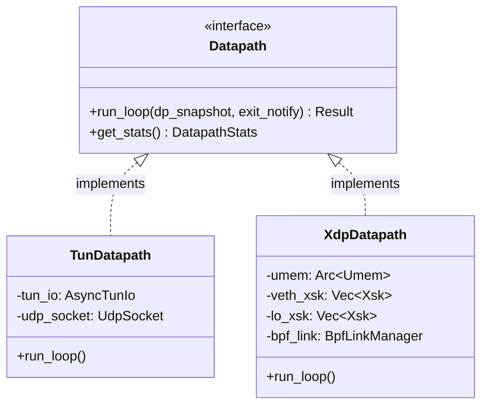

# AF_XDP Datapath Integration Design Spec

- **Date**: 2026-06-11
- **Status**: Proposed (Pending Review)
- **Author**: Antigravity (Google DeepMind pair programming assistant)

---

## 1. Background & Goals

Currently, `new_proxy` operates on a userspace network datapath based on a Linux `TUN` device. While highly portable and well-integrated into Linux kernel routing, it incurs non-trivial system call overhead (`read` / `write`) and kernel VFS lock contention. This limits the single-core throughput on standard 1500-byte physical MTU paths.

To achieve **$\ge 200$ MiB/s** on a single CPU core under high-throughput workloads, we propose adding a high-performance **`AF_XDP`** bypass datapath. This document outlines the unified architecture to run both paths side-by-side, toggleable via runtime config.

### Core Goals:
1. **Dual Datapath Support**: Keep the existing stable `TUN` datapath intact and introduce the `AF_XDP` datapath as an option.
2. **Zero-Copy Performance**: Maximize the throughput using `AF_XDP` Native/Copy modes.
3. **Multi-Queue Scale**: Leverage hardware multi-queue network cards and align worker threads to independent CPU cores and RX/TX queues.
4. **Configuration-Driven**: Allow seamless switching via config fields `quic_interface` and `intercept_interface`.

---

## 2. System Architecture & Trait Abstraction

To keep the main logic in [src/main.rs](file:///home/duanxiongchun/new_proxy/src/main.rs) clean and independent of `AF_XDP` details, we introduce the `Datapath` trait.



### The `Datapath` Trait (`src/datapath.rs`)

```rust
pub trait Datapath: Send + Sync {
    /// Launches the main packet polling loop (non-blocking recv/transmit and routing)
    async fn run_loop(
        self: Arc<Self>,
        dp_snapshot: Arc<arc_swap::ArcSwap<crate::L4DataPlaneSnapshot>>,
        exit_notify: tokio::sync::Notify,
    ) -> Result<(), DatapathError>;

    /// Exposes runtime datapath statistics for CLI monitoring
    fn get_stats(&self) -> DatapathStats;
}
```

---

## 3. Configuration Specification (`GatewayConfig`)

The configuration fields under `[Interface]` are updated to support dual mode. A new optional `[XDP]` section is added for XDP-specific parameters.

```ini
[Interface]
# Datapath mode: "tun" (default) or "af_xdp"
Mode = af_xdp
PrivateKey = ...
Address = 10.0.0.2/24
MTU = 1420

# Optional configuration block evaluated only when Mode = af_xdp
[XDP]
# Interface bound to external QUIC/UDP encrypted tunnel packets
QuicInterface = vs-c

# List of interfaces to intercept plain text traffic (e.g. eth0, lo)
# Note: QuicInterface and InterceptInterfaces may overlap.
InterceptInterfaces = vs-c, lo

# XDP operational mode: "native" (default for driver level) or "generic"
XdpMode = native
```

### Queue and Thread Decoupling:
All interfaces will have `Shared UMEM` enabled globally. The number of hardware queues on the interfaces and the number of worker threads are completely decoupled. The datapath will query the actual hardware channel count of `QuicInterface` and `InterceptInterfaces` at runtime and attach XDP programs to all active queues. The number of worker threads will be configured independently (e.g., matching the number of allocated CPU cores).

---

## 4. XSK-to-Queue Decoupled Mapping with Shared UMEM

To achieve high flexibility and decouple the hardware queue count ($M$) from the userspace worker thread count ($N$), all XDP sockets (XSKs) on a given interface share a single unified memory pool (`Shared UMEM` mode). 

Every worker thread $i$ ($i \in 0 \dots N-1$) creates its own dedicated XSK. The kernel routes packets from any of the $M$ hardware queues to the specific worker's XSK using eBPF redirection maps.

### 1. QUIC Socket (`quic_interface`):
For `quic_interface` (e.g., `eth0` with $M$ queues), worker thread $i$ creates **1 XSK** bound to `eth0` on `Queue (i % M)`. All XSKs on this interface share the same UMEM. The eBPF program redirecting traffic maps external QUIC UDP traffic directly to `quic_xsks_map` using the `worker_id` (hash-based or port-based index) as the key, bypassing hardware queue bounds.

### 2. Intercept Sockets (`intercept_interface`):
For each interface $dev$ in `InterceptInterfaces` (e.g., `eth0` with $M$ queues, or `lo` with 1 queue):
* Worker thread $i$ creates **1 XSK** bound to $dev$ on `Queue (i % M)`.
* All XSKs across all queues on $dev$ **share a single UMEM**.
* The eBPF redirection maps intercepted plain text packets to the target worker's XSK via `intercept_xsks_map` using the `worker_id` as the key.

```
                  [ Queue 0 ... M-1 ] (Hardware RX queues)
                           │
                           ▼
                  [ eBPF XDP Redirect ]
                           │ (Redirect based on Worker ID)
                 ┌─────────┼─────────┐
                 ▼         ▼         ▼
             [ XSK 0 ]  [ XSK 1 ]  [ XSK N-1 ] (All sharing the same UMEM)
                 │         │         │
                 ▼         ▼         ▼
             [Worker 0][Worker 1][Worker N-1] (N user-space threads)
```

---

## 5. eBPF XDP Loader & BPF Redirection Map

We will load a simple eBPF kernel program (`xdp_filter.c`) compiled into ELF format.

### BPF Maps:
1. `quic_xsks_map` (`BPF_MAP_TYPE_XSKMAP`): Key is `worker_id` ($0 \dots N-1$). Contains XSKs for QUIC tunnel traffic.
2. `intercept_xsks_map` (`BPF_MAP_TYPE_XSKMAP`): Key is `worker_id` ($0 \dots N-1$). Contains XSKs for intercepted plain text traffic.

### Kernel-space XDP Logic (`xdp_filter.c`):
```c
SEC("xdp")
int xdp_filter_prog(struct xdp_md *ctx) {
    void *data_end = (void *)(long)ctx->data_end;
    void *data = (void *)(long)ctx->data;

    // Parse L2/L3/L4 headers
    struct ethhdr *eth = data;
    if (eth + 1 > data_end) return XDP_PASS;

    if (eth->h_proto == bpf_htons(ETH_P_IP)) {
        struct iphdr *ip = (void *)(eth + 1);
        if (ip + 1 > data_end) return XDP_PASS;

        // 1. Match external QUIC traffic by configured UDP port
        if (ip->protocol == IPPROTO_UDP) {
            struct udphdr *udp = (void *)(ip + 1);
            if (udp + 1 > data_end) return XDP_PASS;

            if (udp->dest == bpf_htons(QUIC_PORT)) {
                // Distribute packets to workers based on source port hashing to keep flow affinity
                __u32 worker_id = bpf_get_prandom_u32() % WORKER_COUNT; // Or hash(ip->saddr, udp->source) % WORKER_COUNT
                return bpf_redirect_map(&quic_xsks_map, worker_id, 0);
            }
        }

        // 2. Match intercepted plain text traffic (destined for proxy routing)
        if (is_proxy_target(ip->daddr)) {
            // Check for loopback backpass: if source IP matches the local gateway, pass back to kernel
            if (ip->saddr == bpf_htonl(LOCAL_GW_IP)) {
                return XDP_PASS;
            }
            // Distribute plain text client flows to workers to balance CPU utilization
            __u32 worker_id = bpf_get_prandom_u32() % WORKER_COUNT; // Or hash(ip->saddr, ip->daddr) % WORKER_COUNT
            return bpf_redirect_map(&intercept_xsks_map, worker_id, 0);
        }
    }
    return XDP_PASS;
}
```

---

## 6. L2/L3 Packet Processing & NOARP Setup

Since XDP operates on raw Ethernet frames (L2), we must bypass/simplify ARP and MAC mapping to avoid protocol stack duplication in userspace.

### 1. Disabling ARP (NOARP Mode):
We configure the intercepting interfaces inside the target namespace to run without ARP:
```bash
ip link set dev vs-c arp off
```
When ARP is disabled, the local kernel protocol stack directly pushes IP packets into the link without broadcasting ARP queries. Destination MAC addresses are filled with zero or dummy values.

### 2. Static Neighbor (MAC) Configurations:
We inject static neighbor mappings to align destination MAC fields:
```bash
ip neighbor add 10.0.0.1 lladdr 00:11:22:33:44:55 dev vs-c
```

### 3. Userspace Header Processing (Only 14 bytes overhead):
* **Recv Path**:
  When reading packets from `intercept_xsks_map` (plain text), the worker offsets the read pointer by **14 bytes** (`sizeof(struct ethhdr)`) to extract the raw IP packet, passing it directly to the routing/encryption engine.
* **Transmit Path (Loopback Injection)**:
  When injecting decrypted packets back to the local application, the worker prepends a 14-byte Ethernet header:
  ```rust
  let mut eth_header = [0u8; 14];
  eth_header[0..6].copy_from_slice(&local_gw_mac); // Destination MAC
  eth_header[6..12].copy_from_slice(&proxy_mac);   // Source MAC
  eth_header[12..14].copy_from_slice(&[0x08, 0x00]); // EthType: IPv4
  ```
  This is a zero-logic, ultra-fast `memcpy` that incurs negligible CPU overhead.

---

## 7. Plan for Integration & Self-Review

To verify this design, we will:
1. Maintain compile-time compatibility with macOS/Windows by keeping the `AF_XDP` dependencies enclosed in `#[cfg(target_os = "linux")]`.
2. Introduce a new module structure:
   - `src/datapath.rs`: The interface Trait.
   - `src/tun_datapath.rs`: Refactored existing TUN engine.
   - `src/xdp_datapath/`: The eBPF loading, Shared UMEM, and Xsk loop logic.
3. Validate the performance iteratively using the multi-core scalability tests.
